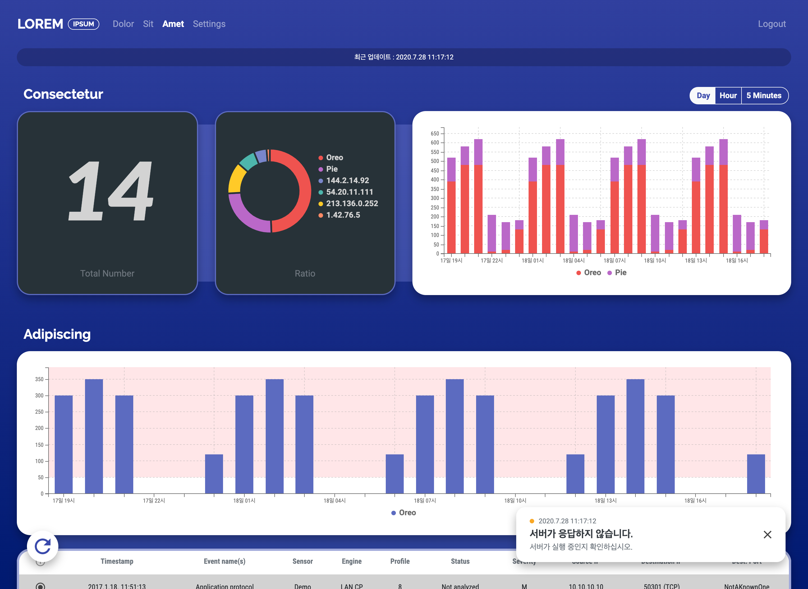

# kpx-ui

My first web application project — a dashboard visualizing network traffic and anomaly-detection results, built for a university research project.

**[Take a look!](https://kpx-ui.netlify.app)**

## Notes

- Four pages: an overview page, a traffic drill-down page, an anomaly-investigation page, and a configuration page for editing whitelist/threshold/IP-alias settings through `EditableTable`, serialized back to JSON with validation.
- The charting libraries (C3.js, vis.js for the network graph) didn't expose much of an API on their own, so `js/chart.js` builds a self-authored `Chart` base class with its own subclasses: `C3` and `Line`/`ZoomableLine`/`Pie` wrap C3.js, `Network` wraps vis.js, and `Texts`/`Score`/`Table`/`EditableTable` are built from scratch with no underlying library at all.
- `ZoomableLine` does drill-down: it re-buckets the full value range into up to 16 histogram bins, and clicking a bar zooms into that bin and re-aggregates it into a fresh set of bins, with a range stack to zoom back out.
- UI widgets follow the same pattern — `js/component.js` has its own `InputGroup` base class with `Dropdown` and `BtnGroup` subclasses.
- Async logic for refreshing data live, and a push-notification/toast system (a `Toast` class in `js/main.js`), were both built for this project.
- The dashboard's page and chart layout is config-driven: `config/page/page.json` sets the refresh interval and maps demo IPs to memorable aliases (macOS/Android codenames — Sierra, High Sierra, Kitkat, Oreo...), while each chart pulls its own data from a JSON file under `input/`, fetched async through a shared `readJSON` helper.
- Went through the full cycle myself: turning an abstract request into a concrete UI/UX, implementing it, and then writing it up as a spec.

## About

- **Timeline:** 2019-07-22 – 2020-05-15
- **Environment:** jQuery, [Bootstrap](https://getbootstrap.com/), [C3.js](https://c3js.org/), [vis.js](https://visjs.org/)

---
[github.com/canplane/kpx-ui](https://github.com/canplane/kpx-ui)
